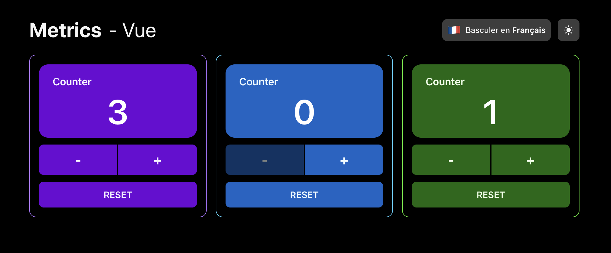

# 〽️ Metrics

This repository contains the result of the home assignment for Diabolocom. The requirements are in the [REQUIREMENTS.md file](./REQUIREMENTS.md).

# 🏆 Results

The resulting Vue application, web components integration test page and Storybook are deployed on [Github Pages](https://nicoinch.github.io/metrics-web-components):

-   [Storybook](https://nicoinch.github.io/metrics-web-components/storybook-static/)
-   [Vue application](https://nicoinch.github.io/metrics-web-components/dist/index.html)
-   [Web components integration test page](https://nicoinch.github.io/metrics-web-components/dist-lib/index.html)

# 🧰 Technologies

Here are the libraries, framework and tools used in this project:

-   **Vue3** to implement the components thanks to the composition API.
-   **Vue I18N** to internationalize the components and manage the locale. A dedicated `<I18nHost />` component has been implemented to allow web components to benefit the internationalization.
-   **Typescript** to type the application.
-   **Vite** to develop and build the application. Two builds were introduced, one to build the Vue application, one to build the web components library.
-   **TailwindCSS** to style the application and manage the dark mode. Semantic colors based on CSS variables have been introduced to simplify dark mode management, moreover in the Web Components.
-   **Storybook** to craft the Vue components and test the `<MetricsCounter />` component with interactions tests. The storybook app is [deployed on **Chromatic**](https://659bc3102843fc3a54305e9d-ylpkykdbqu.chromatic.com/) to allow visual snapshots tests.
-   **Cypress** to test both the Vue application and the Web Components web page.
-   **Eslint** & **Prettier** to ensure a proper code format and avoid common errors.
-   **HTML** & **VanillaJS** to test the web components integration in a simple web page.

# 🛠️ Tools

## Install dependencies

To install dependencies run `npm install` at the project root.

## Start the dev application

To start the dev application run `npm run dev` at the project root.

The application will be available at [http://localhost:5173](http://localhost:5173).

## Start storybook

To start storybook, run `npm run storybook` at the project root.

Storybook will be available at [http://localhost:6006](http://localhost:6006).

## Build the application

To build the application, run `npm run build` at the project root.

It will generate a `dist` folder containing the built application and a `dist-lib` folder containing the built web components library and the example web page.

A preliminary step in included in this command, `npm run tailwind` to generate the CSS styles needed by web components in `style-for-wc.css`.

## Preview the application

To preview the application, run `npm run preview` at the project root. It will build the application and serve it on [http://localhost:4173](http://localhost:4173).

To preview the web components integration test page, run `npm run preview-lib` at the project root. It will serve the content of the `dist-lib` folder on [http://localhost:4174](http://localhost:4174).

## Test the application

To run the Cypress tests, run `npm run cypress:run` at the project root.
To open the Cypress test runner, run `npm run cypress:open` at the project root.

⚠️ The preview applications for Vue & web components must be running to run the Cypress tests.

To ensure the Vue application and the web components integration test page are working properly, the same tests suite is played for both.

## Lint & format the application

To lint the application, run `npm run lint` at the project root. Run `npm run lint:fix` to fix the lint errors.

To format the application, run `npm run prettier:check` at the project root. Run `npm run prettier:format` to fix the formatting errors.
